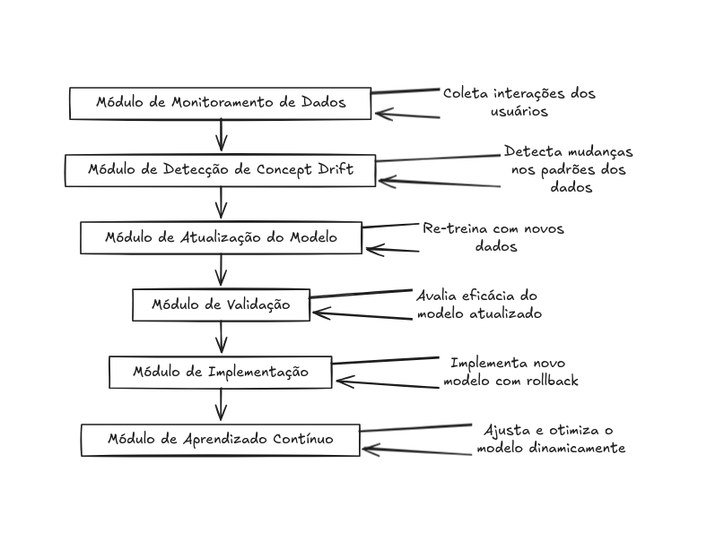

### Proposta de Fomento ao Paradigma de Aprendizado Contínuo no Sistema Conversacional

### 1. Introdução

A falta de atualização de modelos de aprendizado de máquina em sistemas conversacionais pode resultar em uma queda significativa de desempenho ao longo do tempo, causada principalmente pelo fenômeno conhecido como **concept drift**. Esse fenômeno ocorre quando os padrões dos dados mudam, fazendo com que o modelo treinado anteriormente se torne menos preciso e inadequado para as novas situações. Em sistemas de conversação, o concept drift pode se manifestar na forma de respostas desatualizadas, interpretações incorretas e perda de relevância no contexto das interações dos usuários. Assim, torna-se crucial adotar um paradigma de **aprendizado contínuo**, permitindo que o modelo se atualize dinamicamente e mantenha a eficiência em suas previsões. A ausência de mecanismos para esse tipo de atualização pode comprometer a satisfação do usuário, resultando em uma experiência de uso insatisfatória e, potencialmente, no abandono do sistema.

### 2. Solução Proposta

#### Diagrama de Blocos

A proposta de solução pode ser estruturada em um diagrama de blocos com os seguintes componentes:

1. **Módulo de Monitoramento de Dados**: Coleta todas as interações dos usuários e registra dados para futuras análises.
2. **Módulo de Detecção de Concept Drift**: Identifica mudanças nos padrões de dados que podem indicar a necessidade de re-treinar o modelo.
3. **Módulo de Atualização do Modelo**: Re-treina o modelo com os novos dados, ajustando-o às novas realidades detectadas.
4. **Módulo de Validação**: Avalia a eficácia do novo modelo utilizando conjuntos de dados de teste antes de colocá-lo em produção.
5. **Módulo de Implementação**: Implementa o novo modelo no sistema de produção, com uma opção de rollback em caso de falhas.

#### Descrição dos Blocos

- **Módulo de Monitoramento de Dados**: Responsável por observar continuamente as interações do sistema e detectar possíveis mudanças nos dados que podem impactar a performance do modelo.
- **Módulo de Detecção de Concept Drift**: Aplicando técnicas de aprendizado de máquina e estatística, detecta automaticamente se houve uma alteração significativa nos padrões dos dados.
- **Módulo de Atualização do Modelo**: Reprocessa os dados mais recentes para treinar um novo modelo ou ajustar o existente. O treinamento pode ser realizado em intervalos de tempo pré-definidos ou em tempo real.
- **Módulo de Validação**: Executa testes no novo modelo para garantir que ele apresenta desempenho superior ao modelo anterior, sem comprometer a qualidade das respostas.
- **Módulo de Implementação**: Realiza a substituição do modelo antigo pelo novo em produção, garantindo que o sistema não tenha interrupções no serviço e esteja pronto para um possível rollback em caso de erros.

### 3. Conclusão

A adoção de um sistema de aprendizado contínuo para modelos conversacionais é essencial para lidar com o **concept drift** e garantir a relevância das respostas ao longo do tempo. Implementar esse tipo de sistema requer um esforço considerável, especialmente na criação de uma infraestrutura robusta para monitorar, detectar e corrigir concept drifts, além de realizar atualizações periódicas do modelo. No entanto, os benefícios em termos de precisão, satisfação do usuário e longevidade do sistema superam os desafios técnicos e financeiros envolvidos, tornando o investimento essencial para o sucesso de sistemas de conversação que busquem se manter competitivos.

### 4. Referências Bibliográficas

- ŽLI OBIĆ, I.; GAMA, J.; PEA R, A.; BIFET, A. **Learning from Data Streams**. Springer, 2011. Disponível em: https://link.springer.com/book/10.1007/978-3-642-20284-1.
- BIFET, A.; GAVALDA, R. **Adaptive Learning from Evolving Data Streams**. In: Advances in Intelligent Data Analysis. Springer, 2009. Disponível em: https://link.springer.com/chapter/10.1007/978-3-642-03915-7_21.
- HULTEN, G.; DOMINGOS, P. **VFDT: A System for Mining High-Speed Data Streams**. In: Proceedings of the sixth ACM SIGKDD International Conference on Knowledge Discovery and Data Mining. ACM, 2000. Disponível em: https://dl.acm.org/doi/10.1145/347090.347107.
